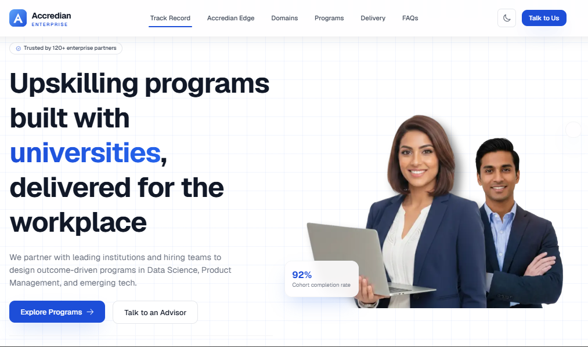
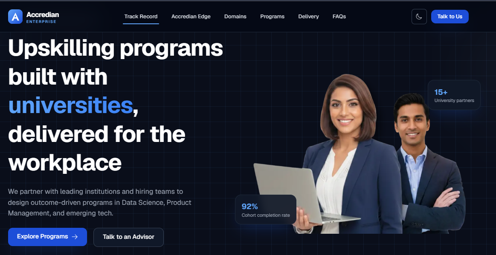
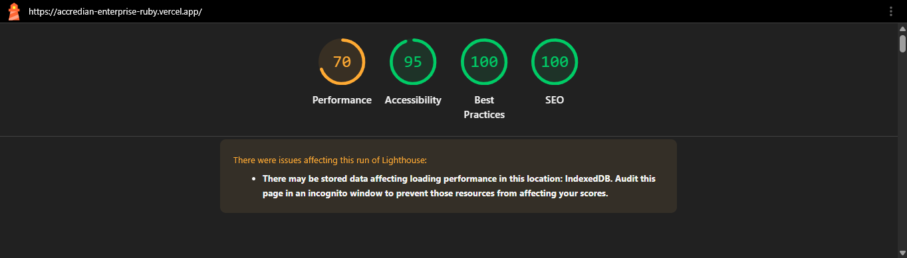

#  Accredian Enterprise Landing Page

> Modern, responsive implementation of the **Accredian Enterprise Landing Page** built with **Next.js**, **React**, and **Tailwind CSS** for the **Accredian Full Stack Developer Internship Assessment**.

<p align="center">
  
</p>

<p align="center">
  
  
  
  
</p>


## 🌐 Live Demo
> https://accredian-enterprise-ruby.vercel.app/

## 💻 GitHub Repository
> https://github.com/priyamvada7078/accredian-enterprise


## 📸 Project Preview

### 🏠 Home Page

<p align="center">
  
</p>

---

### 📱 Mobile View

<p align="center">
  
</p>">
</p>

---

### 🌙 Dark Mode

<p align="center">
  
</p>

---


# ✨ Features

- Responsive layout
- Next.js App Router
- Reusable React components
- Tailwind CSS
- Framer Motion animations
- Glassmorphism Navbar
- Smooth scrolling
- Animated statistics
- FAQ section
- Partner showcase
- Testimonials
- Next.js API Routes
- Optimized images
- SEO-friendly structure
- Vercel ready


# 🛠 Tech Stack

| Technology | Purpose |
|------------|----------|
| Next.js | React Framework |
| React | UI |
| JavaScript | Programming |
| Tailwind CSS | Styling |
| Framer Motion | Animations |
| React Icons | Icons |
| Next.js API Routes | Mock APIs |
| Vercel | Deployment |


# 📂 Project Structure

```text
app/
├── api/
├── components/
│   ├── common/
│   ├── cards/
│   ├── layout/
│   └── sections/
├── constants/
├── hooks/
├── lib/
├── public/
│   ├── images/
│   └── logos/
├── globals.css
├── layout.js
└── page.js
```


# ⚙️ Installation

```bash
git clone https://github.com/YOUR-USERNAME/accredian-enterprise.git
cd accredian-enterprise
npm install
npm run dev


Open:


http://localhost:3000
```

---

# 🏗 Development Approach

The objective was to recreate the structure and user experience of the original landing page while improving maintainability through reusable components, responsive design, and clean project organization.

Focus areas:

- Component-driven architecture
- Responsive-first development
- Accessibility
- Performance
- Modular code
- Clean folder organization

---

# 🎨 UI Enhancements

- Better typography
- Consistent spacing
- Glassmorphism navigation
- Smooth hover effects
- Framer Motion animations
- Modern cards
- Improved responsiveness
- Optimized images


# 🔌 API Routes

## `/api/contact`

Mock endpoint for contact submissions.

## `/api/testimonials`

Returns sample testimonial data.


# 🤖 Responsible AI Usage

AI tools were used as development assistants.

### Tools

- ChatGPT
- Claude

### AI helped with

- Planning
- Component architecture
- Boilerplate
- UI brainstorming
- Debugging
- Refactoring

### Manual contribution

Every AI-generated suggestion was manually reviewed, refined, integrated, and tested before inclusion.


# 👨‍💻 My Contributions

- Designed project architecture
- Built reusable components
- Implemented responsive layouts
- Improved accessibility
- Added animations
- Integrated mock APIs
- Debugged issues
- Tested across devices
- Deployed on Vercel


# 🚀 Future Improvements

- Authentication
- Backend integration
- CMS
- Zod validation
- Unit & E2E testing
- Analytics
- Internationalization


# 📊 Lighthouse

### 📊 Lighthouse Report

<p align="center">
  
</p>

Target:

- 🚀 Performance: 90+
- ♿ Accessibility: 95+
- ✅ Best Practices: 95+
- 🔍 SEO: 100


# 🌍 Deployment

Deploy using Vercel:

```bash
npm install -g vercel
vercel
```

Or import the GitHub repository into Vercel.


# 📄 License

Created exclusively for the **Accredian Full Stack Developer Internship Assessment**.

Original design inspiration belongs to Accredian.


# 🙏 Acknowledgements

- Accredian
- Next.js
- React
- Tailwind CSS
- Framer Motion
- Vercel


<p align="center">

### ⭐ Thank you for reviewing my submission!

Built with ❤️ using Next.js, React & Tailwind CSS.

</p>
